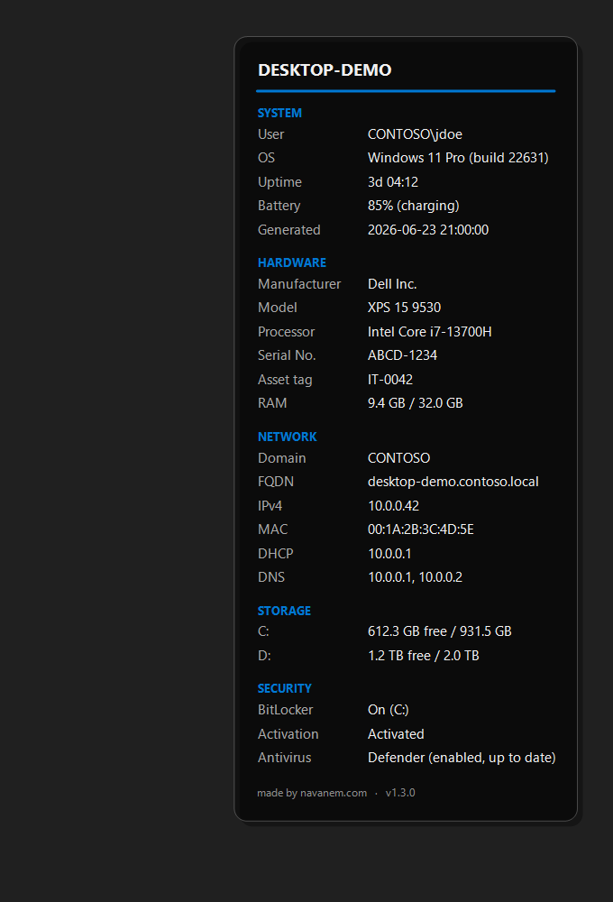

# BgLight

**BgLight** is a lightweight *BGInfo*-like tool for Windows: it draws a "premium" system
information panel on a solid background and applies it automatically as the desktop
wallpaper. It is a *one-shot* executable (it runs, updates the wallpaper, then exits
immediately), silent, with no UI and no external dependency (.NET Framework 4.8, shipped
by default on Windows 10/11).



> Preview rendered with placeholder data. On a real machine the values come from the
> system (WMI + .NET APIs).

---

## Table of contents

- [Features](#features)
- [Displayed information](#displayed-information)
- [Requirements](#requirements)
- [Quick install (binary)](#quick-install-binary)
- [Usage](#usage)
- [Command-line options](#command-line-options)
- [Enterprise deployment](#enterprise-deployment)
- [Building from source](#building-from-source)
- [How it works](#how-it-works)
- [Troubleshooting](#troubleshooting)
- [Versions](#versions)

---

## Features

- **"Premium" panel**: translucent dark card with rounded, anti-aliased corners.
- **Configurable position** (defaults to the **top-right** corner).
- **Header** = computer name, in bold, underlined by an **accent line** whose color is
  configurable (`/accentColor`, default blue `#0078D4`).
- **Two aligned columns** (label / value) for clean readability.
- **Panel footer**: `made by navanem.com` + version number.
- **Robust**: every information source is isolated; if a query fails, the value shows
  `N/A` instead of crashing the tool.
- **Lightweight and non-resident**: no service, no background process; the exe exits as
  soon as the update is done.

## Displayed information

| Field | Source |
|---|---|
| Computer name (title) | `Win32_ComputerSystem` / `Environment.MachineName` |
| **User** | Windows session (`DOMAIN\user`) |
| **Processor** | `Win32_Processor.Name` |
| **Serial No.** | `Win32_BIOS.SerialNumber` |
| **IPv4** | active network interfaces (excluding loopback) |
| **OS** | `Win32_OperatingSystem` (edition + build) |
| **RAM** | used / total (`Win32_ComputerSystem` + `Win32_OperatingSystem`) |
| **Disk (C:)** | free / total (`Win32_LogicalDisk`) |
| **Domain** | domain or workgroup |
| **Generated** | generation date/time |

Sizes are shown in **GB** (gibibytes, base 1024).

## Requirements

- **Runtime**: Windows 10/11. .NET Framework 4.8 is preinstalled on those versions.
- **Build**: the .NET SDK is enough (see [Building from source](#building-from-source));
  Visual Studio 2022 also works.

## Quick install (binary)

1. Download `BgLight-vX.Y.Z.exe` from the
   [**Releases**](https://github.com/navanem/navanem_SysInfoTool/releases) page.
2. (Optional) place it in `%ProgramData%\BgLight\`.
3. Run it once to check the rendering, then schedule it (see
   [Deployment](#enterprise-deployment)).

## Usage

Defaults (panel in the top-right corner, blue accent):

```bat
BgLight.exe
```

With arguments:

```bat
BgLight.exe /position=TopRight /accentColor=#0078D4 /fontSize=11 /fontName="Segoe UI"
```

## Command-line options

Arguments use the `/key=value` form (case-insensitive). An invalid value is ignored and
the default is kept.

| Argument | Default | Description |
|---|---|---|
| `/outputPath` | `C:\ProgramData\BgLight\wallpaper_info.bmp` | Path of the generated BMP (and of `log.txt`) |
| `/position` | `TopRight` | `TopLeft`, `TopRight`, `BottomLeft`, `BottomRight` |
| `/accentColor` | `#0078D4` | Accent line color (hex `#RRGGBB`) |
| `/bgColor` | `#202020` | Solid background color (hex) |
| `/fontSize` | `11` | Body font size (points); the title is slightly larger |
| `/fontName` | `Segoe UI` | Text font |

The error log (`log.txt`) is created in the `outputPath` folder.

## Enterprise deployment

### Scheduled task (recommended for periodic refresh)

```bat
schtasks /create /tn "BgLight"         /tr "%ProgramData%\BgLight\BgLight.exe" /sc onlogon
schtasks /create /tn "BgLight-Refresh" /tr "%ProgramData%\BgLight\BgLight.exe" /sc minute /mo 30
```

- `onlogon`: at every sign-in.
- `/sc minute /mo 30`: refresh every 30 minutes (useful for RAM/disk/IP).

### Logon script (GPO)

1. Copy `BgLight.exe` to `\\server\share\BgLight\` or `%ProgramData%\BgLight\`.
2. GPO → *User Configuration > Policies > Windows Settings > Scripts (Logon)*.
3. Add `deploy\run-bglight.bat`.

## Building from source

The project targets `net48`. It references `Microsoft.NETFramework.ReferenceAssemblies`
**for build only**, which allows building `net48` with just the .NET SDK (no targeting pack
installed); no dependency is added to the shipped exe.

```bash
# Build
dotnet build BgLight.sln -c Release
# -> src/BgLight/bin/Release/net48/BgLight.exe

# Tests
dotnet test -c Debug
```

With Visual Studio: open `BgLight.sln`, select the **Release** configuration, build the
solution.

## How it works

A *one-shot* pipeline runs on every launch:

1. **`AppConfig.Parse`** — reads the `/key=value` arguments and applies defaults.
2. **`SystemInfoCollector.Collect`** — gathers system info (WMI + .NET APIs), each source
   isolated in its own `try/catch` (no exception ever escapes).
3. **`WallpaperRenderer.Render`** — draws the panel (GDI+) on a full-screen bitmap and
   saves it as a BMP.
4. **`WallpaperSetter.Apply`** — applies the BMP as the wallpaper via `SystemParametersInfo`.

Source layout:

| File | Responsibility |
|---|---|
| `Program.cs` | One-shot orchestration + root error handling |
| `AppConfig.cs` | Argument parsing and defaults |
| `SystemInfoCollector.cs` | System information collection |
| `SystemInfoData.cs` | Data model (title + label/value rows) |
| `Format.cs` | Formatting (GB sizes, joins) |
| `WallpaperRenderer.cs` | GDI+ rendering of the panel |
| `WallpaperSetter.cs` | Wallpaper application (P/Invoke) |
| `Logger.cs` | Error logging |

## Troubleshooting

- **Wallpaper does not change / `log.txt` reports access denied**: choose a writable
  `outputPath` (e.g. a folder under `%LOCALAPPDATA%`), or run with sufficient rights on
  `%ProgramData%`.
- **A "forced wallpaper" GPO policy is active**: it can override the wallpaper. Disable the
  policy or deploy the BMP through that same policy.
- **`N/A` values**: the corresponding WMI query failed (permissions, driver, corrupted
  WMI); the other fields stay populated.

## Versions

See [`CHANGELOG.md`](CHANGELOG.md) and the
[Releases](https://github.com/navanem/navanem_SysInfoTool/releases) page.

---

made by [navanem.com](https://navanem.com)
